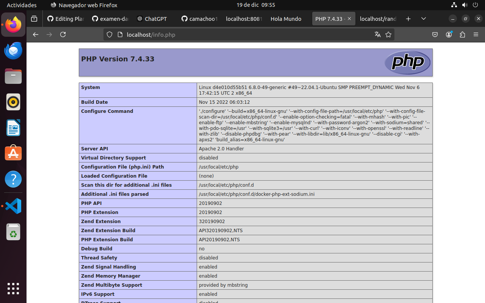

## Sprint 1: Preparación

### 1. **Comprobación de commit y push al repositorio**

1. **Clonación del repositorio**:
   Cloné el repositorio utilizando el siguiente comando:
   ```bash
   git clone https://github.com/camachoo18/examen-dam2-1 .git
   ```
   Para comprobarlo hacemos lo siguiente:
   -git add <README.md>
   -git commit -m "Compruebo commit y push!"
   -git push origin master

### 2. **Documentación para Comprobar la Sesión en Docker Hub**

## Paso 1: Abrimos una Terminal
Asegurarnos de que en la terminal o consola de nuestro sistema que tenemos instalado Docker.

## Paso 2: Verifica la Sesión Actual
Ejecutamos el siguiente comando para verificar si estás autenticado en Docker Hub:

```bash
docker info
```

Buscamos en la salida una línea similar a:

```
Username: <camachoo18>
```

Si aparece mi nombre de usuario de Docker Hub, significa que tengo la sesion iniciada.


## Paso 3: Cerrar Sesión (Opcional)
Si deseas cerrar sesión después de confirmar el inicio, utiliza el siguiente comando:

```bash
docker logout
```

Esto asegurará que no queden sesiones activas no deseadas en nuestro sistema.

# Sprint 2: Apache

Este documento describe los pasos realizados para crear un servidor web Apache que sirva un archivo `index.html` con el mensaje "Hola Mundo".

## Paso 1: Creamos la Carpeta y el Archivo Dockerfile
1. Creamos una carpeta llamada `apache`:
   ```bash
   mkdir apache
   cd apache
   ```

2. Dentro de la carpeta, creamos un archivo llamado `Dockerfile`:
   ```bash
   touch Dockerfile
   ```

## Paso 2: Configurar el Dockerfile
Editamos el archivo `Dockerfile` con el siguiente contenido:

```dockerfile
# Usa la imagen base de Apache
FROM httpd:2.4

# Copiamos el archivo index.html al directorio de contenido web de Apache
COPY index.html /usr/local/apache2/htdocs/
```

## Paso 3: Creamos el Archivo `index.html`
Creamos un archivo `index.html` en la misma carpeta con el siguiente contenido:

```html
<!DOCTYPE html>
<html lang="es">
<head>
    <meta charset="UTF-8">
    <meta name="viewport" content="width=device-width, initial-scale=1.0">
    <title>Hola Mundo</title>
</head>
<body>
    <h1>Hola Mundo</h1>
</body>
</html>
```

## Paso 4: Construir la Imagen
Ejecutamos el siguiente comando para construir la imagen Docker:

```bash
docker build -t apache-hola-mundo .
```

## Paso 5: Lanzamos el Contenedor
Iniciamos un contenedor a partir de la imagen creada:

```bash
docker run -d -p 8080:80 --name apache-servidor apache-hola-mundo
```

El servidor web estará disponible en (http://localhost:8080).

## Paso 6: Verificar el Funcionamiento
Abr mi navegador y voy a `http://localhost:8080` para ver la página "Hola Mundo".


# Sprint 3: Apache + PHP

## Paso 1: Creamos la Carpeta y Configuramos el Dockerfile
1. Copiamos la carpeta `apache` creada en el Sprint 2 y renómbrala a `apache-php`:
   ```bash
   cp -r apache apache-php
   cd apache-php
   ```

2. Edita el archivo `Dockerfile` con el siguiente contenido:

```dockerfile
# Usamos la imagen base de Apache con soporte para PHP
FROM php:7.4-apache

# Copiamos el archivo index.php al directorio de contenido web de Apache
COPY index.php /var/www/html/
```

## Paso 2: Creamos el Archivo `index.php`
Creamos un archivo `index.php` en la carpeta con el siguiente contenido:

```php
<?php
// Muestra un mensaje de Hola Mundo
echo "<h1>Hola Mundo</h1>";

// Muestra la fecha y hora actual
echo "<p>Fecha y hora actual: " . date('Y-m-d H:i:s') . "</p>";

// Muestra la versión de PHP
echo "<p>Versión de PHP: " . phpversion() . "</p>";

// Muestra la versión de Apache
echo "<p>Versión de Apache: " . apache_get_version() . "</p>";

// Muestra la IP del servidor
echo "<p>IP del servidor: " . $_SERVER['SERVER_ADDR'] . "</p>";

// Muestra la IP del cliente
echo "<p>IP del cliente: " . $_SERVER['REMOTE_ADDR'] . "</p>";
?>
```

## Paso 3: Construimos la Imagen
Ejecutamos el siguiente comando para construir la imagen Docker:

```bash
docker build -t apache-php-info .
```

## Paso 4: Lanzamos el Contenedor
Iniciamos un contenedor a partir de la imagen creada:

```bash
docker run -d -p 8081:80 --name apache-php-servidor apache-php-info
```

El servidor web estará disponible en (http://localhost:8081).

## Paso 5: Verificar el Funcionamiento
Abrimos un navegador y vamos a `http://localhost:8081` para ver la información dinámica generada por el archivo `index.php`.


# Sprint 4 - PHP
Dentro de la carpeta que hemos creado de apache-php, haremos lo siguiente

## Archivos creados

### 1. `info.php`
Este archivo muestra toda la información de configuración de PHP utilizando la función `phpinfo()`. Al acceder a este archivo desde un navegador, podrás ver la configuración de PHP en tu servidor.
```php
<?php
// Muestra toda la información de configuración de PHP
phpinfo();
?>

```

### 2. `random.php`

```php
<?php
// Genera un número aleatorio entre 1 y 100
$randomNumber = rand(1, 100);

// Determina si el número es par o impar
$paridad = ($randomNumber % 2 == 0) ? 'par' : 'impar';

// Crea un array con al menos 5 elementos
$elementos = ['sushi', 'ramen', 'chocolate Milka', 'tulipanes', 'black baccara'];

// Selecciona un elemento aleatorio del array
$elementoAleatorio = $elementos[array_rand($elementos)];

// Crea un array asociativo con los resultados
$response = [
    'numero' => $randomNumber,
    'mensaje' => "El número $randomNumber es $paridad.",
    'elemento' => $elementoAleatorio
];


// Devuelve el resultado en formato JSON
echo json_encode($response);
?>
```
Este archivo devuelve un JSON con:
- Un número aleatorio entre 1 y 100.
- Un mensaje indicando si el número es par o impar.
- Un elemento aleatorio de un array con al menos 5 elementos.

### 3. Docker

Para lanzar el servidor Apache-PHP, se utilizó Docker. El proceso fue:
1. Modificamos nuestro `Dockerfile` con la imagen oficial de PHP y Apache.
```dockerfile
## Usamos la imagen base de PHP con soporte para Apache
FROM php:7.4-apache

# Copiamos todos los archivos al directorio de contenido web de Apache
COPY . /var/www/html/

# Establecemos el ServerName para evitar la advertencia
RUN echo "ServerName localhost" >> /etc/apache2/apache2.conf

# Ajustamos los permisos para asegurar que Apache pueda acceder a los archivos
RUN chown -R www-data:www-data /var/www/html

# Expone el puerto 80 (por defecto Apache usa este puerto)
EXPOSE 80


```
2. Construir la imagen con el comando `docker build -t php-apache .`.
      Construir la Imagen
Ejecutamos el siguiente comando para construir la imagen Docker:

```bash
docker build -t php-apache .

```
3. Lanzar el servidor localmente con `docker run -p 80:80 php-apache`.
         Lanzar la Imagen
Ejecutamos el siguiente comando para ejecutar la imagen Docker:

```bash
docker run -p 80:80 php-apache

```
Para lanzarla localmente, haremos lo siguiente:
http://localhost/info.php-----Esto debería mostrarte toda la información de configuración de PHP, tal como lo especifica la función phpinfo().


http://localhost/random.php-----Esto debería devolver un JSON con el número aleatorio, el mensaje sobre su paridad (si es par o impar), y un elemento aleatorio del array que definiste en el archivo PHP.
